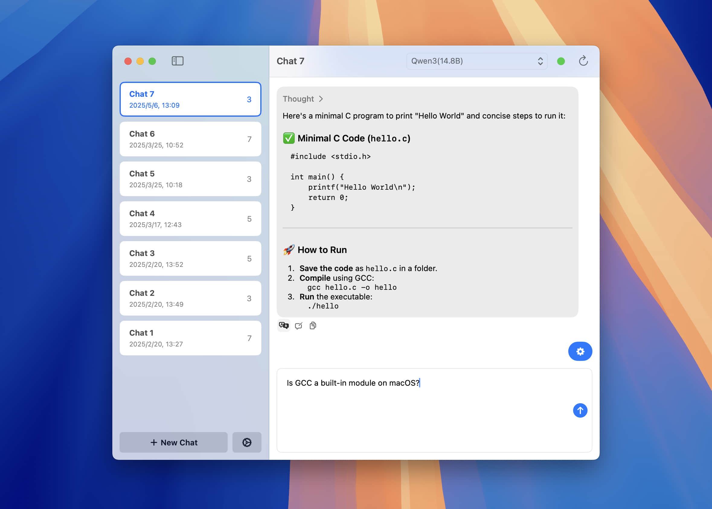

# Ollama Chat

    

A user-friendly interface for [Ollama](https://ollama.ai) created in SwiftUI.

This project is a fork of [@kghandour](https://github.com/kghandour)'s [Ollama-SwiftUI](https://github.com/kghandour/Ollama-SwiftUI) with extra features:

- Option to retry and edit messages
- Use `cmd` + `enter` to send a message
- Support for system prompts
- Access to chat history
- Compatibility with macOS 13

**This app requires [Ollama](https://ollama.ai) to be installed and running to function.**

If you already have Ollama installed, you can now download **Ollama Chat**:

    

## Getting Started:
1. Install Ollama (https://ollama.ai)
2. Run Ollama
3. Launch the Ollama Chat app
4. Download your first model by going into Manage Models
    - Check possible models to download on: https://ollama.com/search
    - Copy and paste the name and press the download button
5. Select the model from the dropdown on the main page to start your conversation
6. Write your prompt and start the conversation!

## Frequently Asked Questions:
### 1. I am getting a "Server is unreachable" error
- You need to download and install https://ollama.ai, and it must be running in the background for this interface to work.

### 2. How to change the target IP and port?
- You can modify the IP address and port in the settings. Ollama Chat > Preferences

### 3. Are there any system requirements?
- This is a very simple, lightweight user interface. As long as you can run https://ollama.ai locally, then this application should work as well.

## Feedback and Contributions:
For bugs and feedback, please create a new issue.

Feel free to contribute by creating a pull request, and the best effort will be made to review and merge it.
